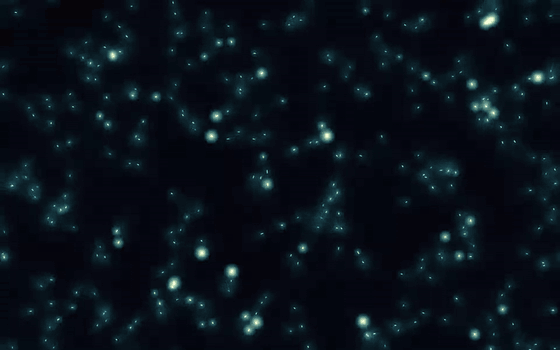

# Emergent Lights

An interactive animation: hundreds of tiny lights, each following a few simple rules, that grow flocks, whirlpools, glowing rivers and waves of synchronized flashing all on their own.

**Live demo:** https://sz822.github.io/emergent-lights/

## The rules (plain English)

Each light can only see a small circle of neighbors. There is no leader, and no one knows what the whole picture looks like.

1. **Personal space**: if a neighbor gets too close, step aside a little.
2. **Go with the flow**: turn a little toward the way your neighbors are heading.
3. **Stay together**: drift a little toward where your neighbors are gathered.
4. **Follow the scent**: everywhere you go, you leave a faint scent that slowly fades. Lean toward whichever side ahead smells stronger. The more lights walk a path, the clearer it gets.
5. **Catch the rhythm**: each light has an inner clock that runs at its own pace and flashes when it runs out. Seeing a neighbor flash nudges your own clock forward a bit.

Rules 1 to 3 come from classic flocking simulations, rule 4 from how slime mold and ants find paths, and rule 5 from fireflies that flash in unison. Put them together and you get patterns the program never describes.

## How to play

- Move the mouse: a predator that scatters the lights
- Hold the mouse button: food that attracts them
- Double-click: startle a whole area
- Drag a slider all the way left to switch that rule off and watch the order fall apart
- Space = pause, H = hide panel, R = restart

Plain HTML and JavaScript with nothing to install. Open `index.html` in any browser.
